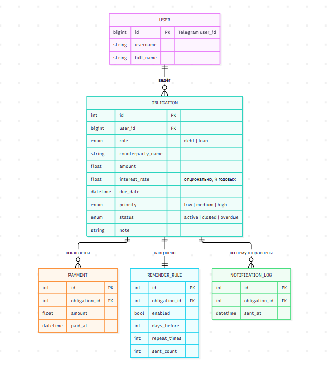
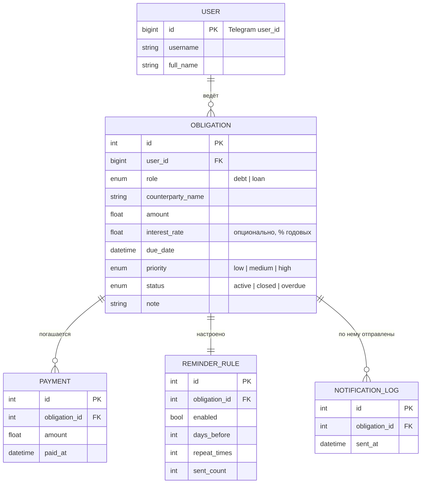
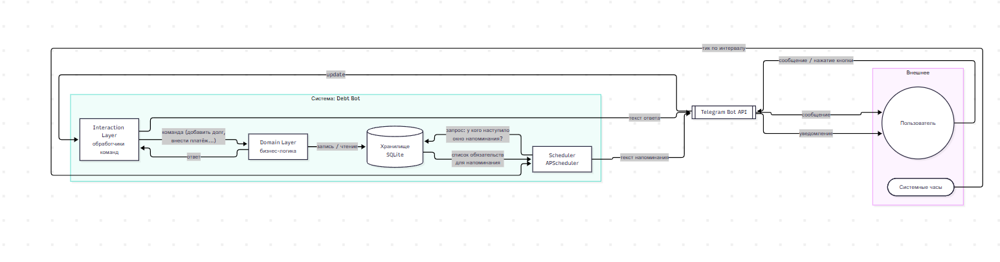
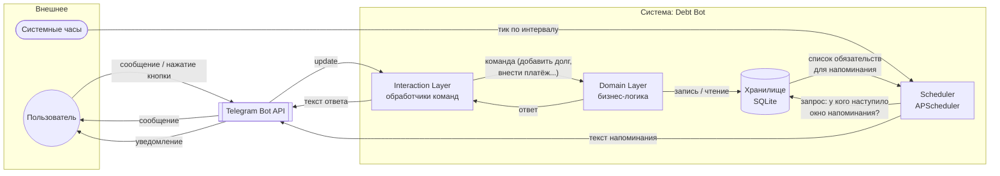
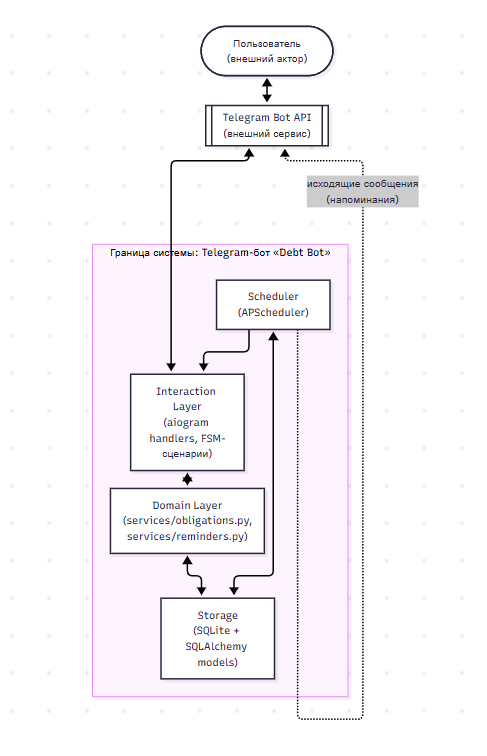
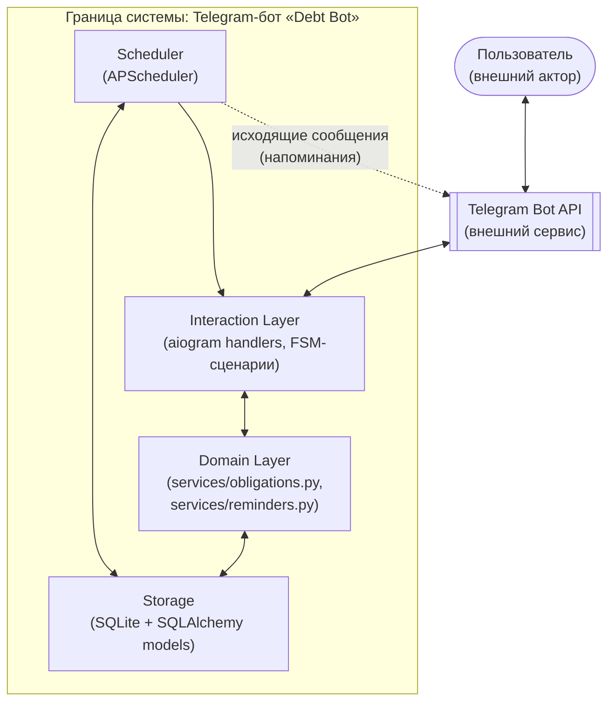

# Debt Bot — Telegram-бот для учёта долгов и займов

Бот ведёт учёт задолженностей с двух сторон (я должен / мне должны),
фиксирует платежи, приоритеты и присылает напоминания о датах платежей по
настраиваемому расписанию. Опционально считает ориентировочные проценты и
даёт общую финансовую сводку.

Этот README состоит из двух частей:
1. **Информационная модель** — как задача разложена на сущности, потоки и
   системы (то, ради чего, собственно, и делалось задание).
2. **Как запустить и пользоваться ботом.**

---

## Часть 1. Информационная модель

Ниже — три разных среза одной и той же предметной области. Это сделано
намеренно: сущности отвечают на вопрос «что хранится», потоки — «что
движется и в какой последовательности», система — «где проходит граница
между тем, что мы строим, и внешним миром».

### 1.1. Сущности (статический срез, ER)

Сущность — это то, что имеет самостоятельный жизненный цикл и хранимое
состояние. Ключевое решение при моделировании: **долг и заём — не две
разные сущности, а одна и та же сущность «Обязательство» с полем-ролью**.
С точки зрения структуры данных они устроены абсолютно одинаково (сумма,
контрагент, дата, приоритет, статус, платежи, напоминания) и отличаются
только тем, с какой стороны на них смотрит пользователь. Заведение двух
параллельных таблиц (Debt/Loan) было бы дублированием одной и той же
структуры и почти наверняка разошлось бы в логике при развитии кода — это
тот самый смысл «упрощения на схеме», о котором говорилось в задании.



Пояснения по сущностям:

| Сущность | Что это | Почему выделена отдельно |
|---|---|---|
| **User** | Пользователь бота | Один и тот же человек ведёт и долги, и займы — это не два типа аккаунта, а два раздела данных одного владельца |
| **Obligation** | Обязательство (долг ИЛИ заём — различается полем `role`) | Центральная сущность; вокруг неё строится весь остальной функционал |
| **Payment** | Факт частичного/полного погашения | Вынесена отдельно, а не как одно число «оплачено», чтобы хранить историю платежей и уметь считать частичные погашения |
| **ReminderRule** | Настройка напоминаний конкретно для этого обязательства | Пользователь сам решает, напоминать ли и как часто — по заданию это должно быть per-запись, а не глобальная настройка |
| **NotificationLog** | Журнал отправленных уведомлений | Нужен, чтобы не слать напоминание повторно в один день и не терять историю рассылок |

### 1.2. Потоки (динамический срез, DFD)

Поток — это не то, что хранится, а то, что *движется* между компонентами:
пользовательский ввод, срабатывание таймера, изменение статуса как
следствие события. Здесь три ключевых потока.




Три потока, которые здесь закодированы:

1. **Поток пользовательского ввода** (синхронный, инициируется пользователем):
   `Telegram → Interaction Layer → валидация FSM → Domain Layer → запись в БД → ответ пользователю`.
   Пример: добавление долга — бот пошагово запрашивает контрагента, сумму,
   ставку, дату, приоритет, комментарий, и только после последнего шага
   пишет одну целостную запись в БД.

2. **Поток планировщика** (асинхронный, инициируется временем, а не
   пользователем): каждые N минут `Scheduler` опрашивает БД на предмет
   обязательств, у которых наступило "окно напоминания" (дней до срока
   ≤ `days_before` и лимит `repeat_times` ещё не исчерпан), формирует текст
   и отправляет его через Telegram API, параллельно фиксируя факт отправки
   в `NotificationLog`, чтобы не задублировать.

3. **Поток пересчёта состояния**: платёж → пересчёт остатка
   (`amount − Σ payments`) → пересчёт статуса (`active` / `closed` /
   `overdue`) → (опционально) пересчёт накопленных процентов. Важно, что
   это не отдельное хранимое поле "остаток", а вычисляемая проекция —
   единственный источник истины это сумма и список платежей, что исключает
   рассинхронизацию.

### 1.3. Система (граница + компоненты)

Систему стоит рассматривать как «чёрный ящик» с явной границей: что
находится внутри зоны нашей ответственности, а что — внешний контрагент,
с которым мы просто обмениваемся сообщениями по протоколу.



Что внутри границы системы и почему:

- **Interaction Layer** — единственная точка контакта с внешним миром
  (Telegram API). Не содержит бизнес-логики, только маршрутизацию
  команд/кнопок и пошаговые диалоговые сценарии (FSM).
- **Domain Layer** — вся смысловая логика: расчёт остатков, статусов,
  процентов, правил напоминаний. Не знает про Telegram вообще — это
  сделано специально, чтобы бизнес-логику можно было переиспользовать,
  если интерфейс сменится (например, добавится веб-версия).
- **Storage** — единственный источник истины о состоянии. Взаимодействует
  и с Domain Layer (по запросу пользователя), и со Scheduler (по таймеру).
- **Scheduler** — единственный компонент, который может инициировать
  исходящее сообщение *без* входящего запроса пользователя — отдельная,
  специально выделенная зона ответственности, потому что это единственный
  «активный» (proactive) компонент системы, все остальные реактивны.

Что снаружи границы и почему это важно проговорить:

- **Пользователь** — источник и получатель информации, но не часть
  системы: система не может ничего знать о нём, кроме того, что он сам
  сообщил через Telegram.
- **Telegram Bot API** — внешняя система связи. Наш бот полностью зависит
  от её доступности, но не управляет её внутренним устройством — это
  классическая граница "интеграция по протоколу", а не "владение
  компонентом".

---

## Часть 2. Функциональность → сценарии использования (Use Cases)

| # | Сценарий | Инициатор |
|---|---|---|
| UC1 | Выбор ветки (Должник / Кредитор) в главном меню | Пользователь |
| UC2 | Добавить обязательство (контрагент, сумма, ставка, дата, приоритет, комментарий) | Пользователь |
| UC3 | Посмотреть список обязательств по ветке, открыть карточку записи | Пользователь |
| UC4 | Внести платёж (полный или частичный) по обязательству | Пользователь |
| UC5 | Настроить напоминания для конкретной записи (вкл/выкл, за сколько дней, сколько раз) | Пользователь |
| UC6 | Получить напоминание о приближающемся/просроченном платеже | Scheduler (проактивно) |
| UC7 | Посмотреть общую сводку: сколько всего должен(на) / сколько должны, ориентировочные проценты | Пользователь |

---

## Часть 3. Технологии

- **Python 3.11+**
- **aiogram 3.x** — асинхронный фреймворк для Telegram-ботов, встроенный
  FSM удобен для пошаговых сценариев ввода (UC2, UC4, UC5).
- **SQLAlchemy 2.0 (ORM)** — модели напрямую отражают сущности из части 1.1.
- **SQLite** — файловая БД, не требует отдельного сервера, удобно для
  демонстрации и локального запуска.
- **APScheduler** — фоновая проверка напоминаний по интервалу.
- **python-dotenv** — токен и настройки через `.env`, не хардкодятся.

---

## Часть 4. Структура репозитория

```
debt-bot/
├── README.md
├── requirements.txt
├── .env.example
└── bot/
    ├── main.py                      — точка входа, сборка Dispatcher, запуск планировщика
    ├── db.py                        — подключение к SQLite
    ├── models.py                    — ORM-модели = формализация сущностей из части 1.1
    ├── states.py                    — состояния FSM для пошаговых сценариев
    ├── keyboards.py                 — inline-клавиатуры
    ├── handlers/
    │   ├── common.py                — /start, главное меню, общая сводка (UC1, UC7)
    │   ├── obligations.py           — добавление/список/платежи (UC2–UC4), общий для обеих ролей
    │   ├── debtor.py                — точка входа ветки «Должник» (реэкспорт router)
    │   ├── creditor.py              — точка входа ветки «Кредитор» (реэкспорт router)
    │   └── reminder_settings.py     — настройка напоминаний по записи (UC5)
    └── services/
        ├── obligations.py           — бизнес-логика: остатки, статусы, проценты, сводка
        └── reminders.py             — поиск обязательств для напоминания (UC6)
```

> Почему `debtor.py` и `creditor.py` — тонкие файлы, а не полноценные
> независимые модули: см. пояснение в docstring `handlers/obligations.py`
> и в разделе 1.1 — с точки зрения структуры данных это одна и та же
> сущность с разным значением роли, дублировать логику не было смысла.

---

## Часть 5. Как запустить

1. Получить токен бота у [@BotFather](https://t.me/BotFather) в Telegram.
2. Установить зависимости:
   ```bash
   python -m venv venv
   source venv/bin/activate   # Windows: venv\Scripts\activate
   pip install -r requirements.txt
   ```
3. Скопировать `.env.example` в `.env` и вписать токен:
   ```bash
   cp .env.example .env
   ```
4. Запустить бота:
   ```bash
   python -m bot.main
   ```
5. Найти бота в Telegram по имени, которое задавали в BotFather, и нажать
   **Start**.

База данных (`debt_bot.db`) создастся автоматически при первом запуске
рядом с проектом.

---

## Часть 6. Известные ограничения MVP (осознанно не делали)

- Если пользователь стартует один сценарий (например, добавление долга) и
  не завершает его, а нажимает другую кнопку меню — состояние FSM не
  сбрасывается автоматически. Для MVP это не критично, но при развитии
  стоит добавить явный "выход" из любого сценария по кнопке "Отмена".
- Долг/заём не привязываются к реальному второму пользователю бота (если
  оба контрагента — реальные люди с ботом) — каждая запись независима и
  привязана только к своему владельцу. Сшивание сторон сделки — возможное
  направление развития, не входящее в это ТЗ.
- Расчёт процентов — это оценка простыми процентами от текущего остатка,
  а не юридически точный расчёт по конкретному договору/графику.
